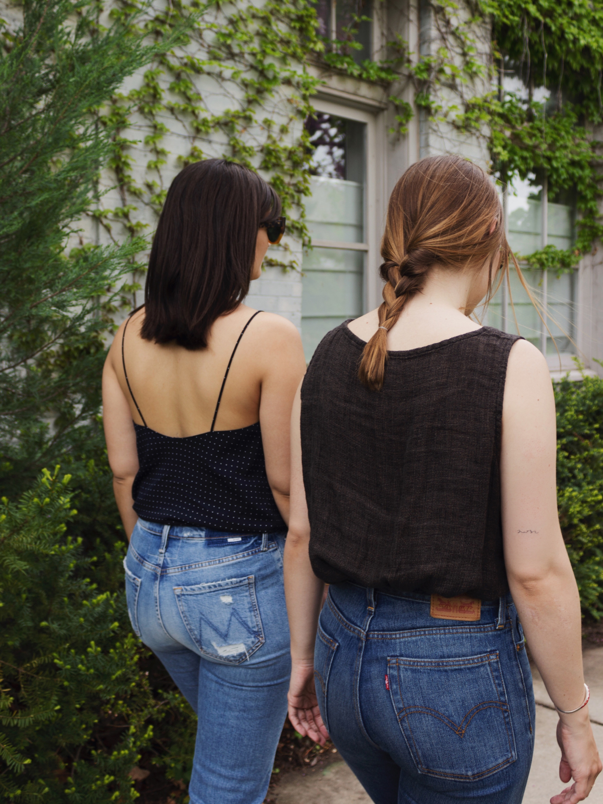
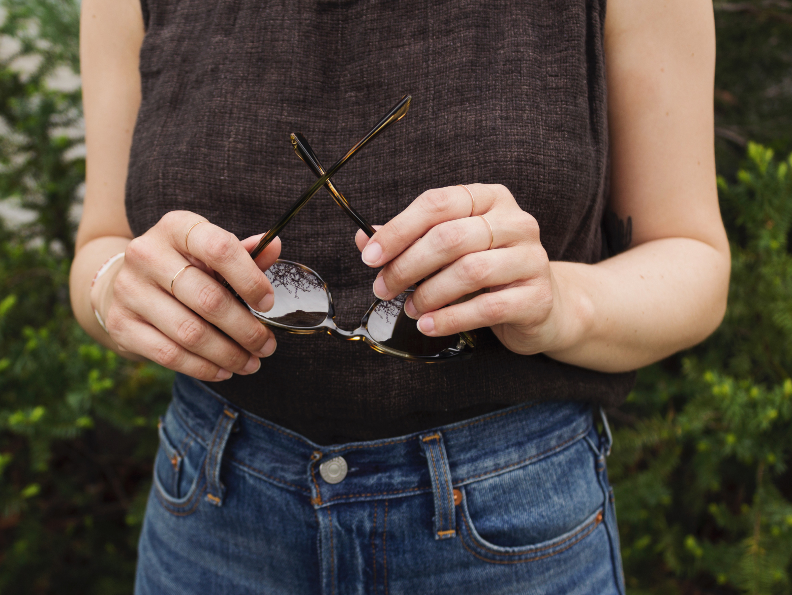
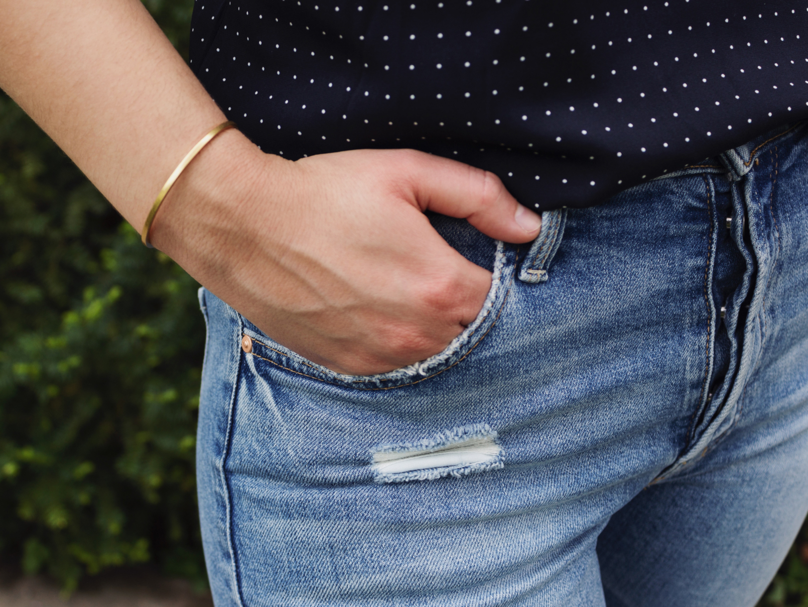
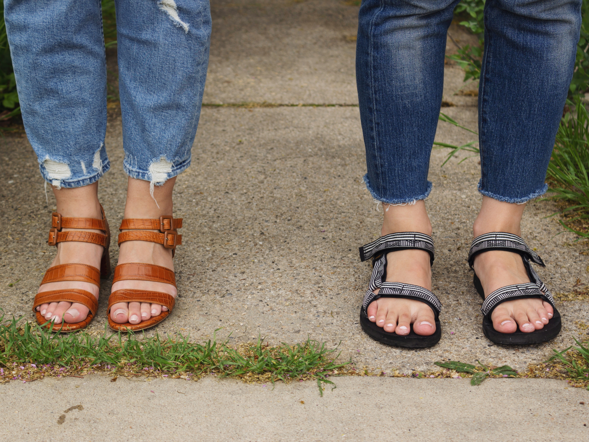

The classics are classics for a reason. But that doesn’t mean you can’t put your own spin on them.

Take these outfits, for example. There’s not anything innovative about them—just jeans, tanks, and sandals—but our individual interpretation of that formula created two distinctly different looks.

Jacqs’ outfit is cool and casual, with a dash of vintage boho that makes her seem equally suited to shopping at the local farmer’s market as it does setting off an an Insta-worthy cross-country road trip.

Sara’s ensemble takes a slightly more modern, polished approach, pairing distressed denim with a simple silk cami and tan leather sandals that have just enough of a heel to add a touch of sophistication.

And that’s the beauty of formulaic dressing: the equation is simple—the end result is anything but.

## Sara’s wearing

- Dot V-Neck Cami by AYR (old)
- [Tomcat Jeans by Mother](https://www.motherdenim.com/products/tomcat-the-confession)
- [Jardin Heel by Marais USA](https://www.maraisusa.com/search?q=jardin&type=product)
- [Sunglasses by Matt & Nat](https://mattandnat.com/shop/lifestyle/sunglass-collection/mule-leopard-mustard-mix)

## Jacq’s wearing

- Linen tank by Eileen Fisher (vintage)
- Wedgie Fit Jeans by Levi’s (old wash) | [Similar](https://www.levi.com/US/en_US/clothing/women/jeans/wedgie-fit-straight-jeans/p/349640012)
- [Sandals by Teva](https://www.teva.com/women-sandals/original-universal/1003987.html?dwvar_1003987_color=SAMIB#start=2&cgid=women-originals)
- [Rings by Hannah Naomi](https://www.etsy.com/listing/197650257/rose-gold-stacking-rings-set-of-4-rose?ref=shop_home_active_80)
- [Sunglasses by Warby Parker](https://www.warbyparker.com/sunglasses/women/percey/striped-sassafras)
