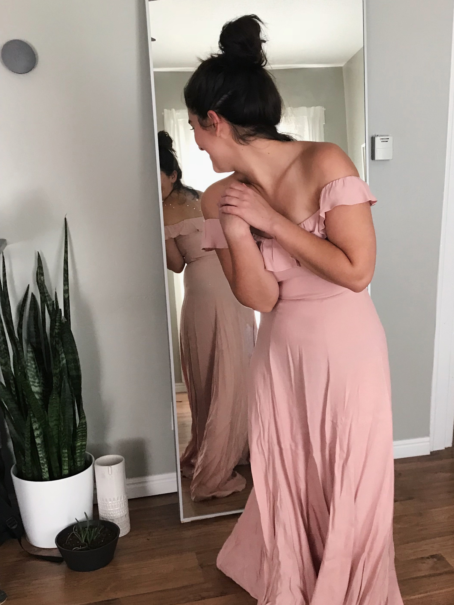

I’m just going to come right out and say it: being a bridesmaid is the most cutthroat competition you’ll ever be in. It shouldn’t be, I know. And we all pretend it isn’t. But the truth is, there isn’t a single bridesmaid in the world who hasn’t wanted to be the favorite. And there isn’t a single bride who doesn’t know which of her friends she likes the most.

And the most frustrating part of it all is that we’re supposed to pretend this maid-eat-maid fight for friendship superiority isn’t happening. We’re supposed to smile and drink champagne and get our nails done together while we talk about how this wedding has really helped us grow closer (BFFs 4eva!!!).

But below that shiny varnished surface, it’s a no-holds-barred mud wrestling battle royale. It’s shallow and vicious and subversive—all of the things I find so frustrating about girl-on-girl competition.

So why do we do it?

Maybe it’s because we’ve been conditioned to believe there’s only room for one woman at the top. Maybe we’re so used to fighting for what we want, that we’ve lost the ability to recognize a comrade in arms. Maybe we are so scared of coming up short that we feel desperate to tear each other down.

So, I’ll be honest: I want to be the hottest bridesmaid at my friend’s wedding because superiority (of basically any variety) makes me feel valuable and I am terrified of feeling less than. I want to not feel that way, but I do. I want to be more evolved than that, but I’m not. I wish I could tell you how I plan to change that, but I don’t know.

But if you, like me, are in the throes of bridesmaid-dom, I can at least offer you this: hang in there. And if you, like me, sometimes crave external validation...well, maybe we should offer each other something.

Maybe, as women, we should practice openly admiring one another because deep down we know that the things we love about others shouldn’t have any effect on our own self worth. Maybe we should be more open about our feelings of jealousy and inferiority because we all have them sometimes and that’s okay. It’s hard and scary and uncomfortable, but we owe it to ourselves. And I think we owe it to each other, too.

- [Blue Wrap Dress by Reformation](https://www.thereformation.com/products/winslow-dress?color=Ivory&via=Z2lkOi8vcmVmb3JtYXRpb24td2VibGluYy9Xb3JrYXJlYTo6Q2F0YWxvZzo6Q2F0ZWdvcnkvNWE2YWRmZDJmOTJlYTExNmNmMDRlOWM3)
- [Pink Ruffle Dress by Reformation](https://www.thereformation.com/products/verbena-dress?color=Emerald&via=Z2lkOi8vcmVmb3JtYXRpb24td2VibGluYy9Xb3JrYXJlYTo6Q2F0YWxvZzo6Q2F0ZWdvcnkvNWE2YWRmZDJmOTJlYTExNmNmMDRlOWM3)
- [Shoulder Tie Floral Dress by Reformation](https://www.thereformation.com/products/nikita-dress?color=Navy&via=Z2lkOi8vcmVmb3JtYXRpb24td2VibGluYy9Xb3JrYXJlYTo6Q2F0YWxvZzo6Q2F0ZWdvcnkvNWE2YWRmZDJmOTJlYTExNmNmMDRlOWM3)
